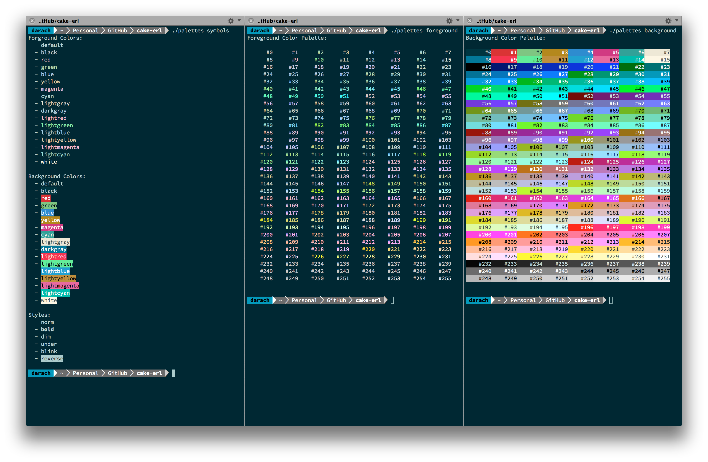

**cake-erl** [](https://travis-ci.org/darach/cake-erl)

========

Cake is a very simple library to assist with colorization
of console (terminal) output using terminal escape codes.

## Have your cake

To change the foreground color:

```erlang
io:format("~s~n", [cake:fg(blue,"Hello")]).
```

To change the background color:
```erlang
io:format("~s~n", [cake:bg(green,"World!")]).
```

To change text style:
```erlang
io:format("Hello ~s~n", [cake:ta(bold,"World!")]).
```

It is also possible to use numeric color codes with the cake:fg/2 and cake:bg/2
functions.

## And eat it too

For a sprinkle of happiness in your console apps:

```escript
#!/usr/bin/env escript
%%! -pa ebin
%% File: palettes

%% Vt100 color names
-define(COLORS, [
    default,black,red,green,blue,yellow,magenta,cyan,lightgray,darkgray,
    lightred,lightgreen,lightblue,lightyellow,lightmagenta,lightcyan,
    white ]).

%% VT100 text attributes
-define(STYLES, [norm,bold,dim,under,blink,reverse]).

main(Args) ->
    IsSymbols = length(Args) =:= 1 andalso lists:nth(1,Args) =:= "symbols",
    IsFore = length(Args) =:= 1 andalso lists:nth(1,Args) =:= "foreground",
    IsBack = length(Args) =:= 1 andalso lists:nth(1,Args) =:= "background",
    if IsSymbols orelse length(Args) =:= 0 ->
       %% Explain symbolic colors and styles visually
       explain("Forground Colors", fg, ?COLORS),
       explain("Background Colors", bg, ?COLORS),
       explain("Styles", ta, ?STYLES);
       true -> ok
    end,
    if IsFore orelse length(Args) =:= 0 ->
       %% Explode foreground numeric color palette visually
       palette("Foreground Color Palette", fg);
       true -> ok
    end,
    if IsBack orelse length(Args) =:= 0 ->
        %% Explode background numeric color palette visually
        palette("Background Color Palette", bg);
        true -> ok
    end.

explain(Cat,Fn,Sym) ->
    io:format("~s:~n", [Cat]),
    [ io:format("  - ~s~n", [cake:Fn(X,atom_to_list(X))]) || X <- Sym],
    io:format("~n",[]).
    
%% Create a full palette of 256 cells in 32 rows
palette(S, Fn) ->
    %% header
    io:format("~s:~n~n", [S]),

    %% Generate 32 rows of 8 color codes
    Palette = split(8,lists:seq(0,255)),
    %% Paint colorized rows
    [ row(Z) || Z <- [[ colorize(Y,Fn) || Y <- X] || X <- Palette ]],

    %% footer
    io:format("~n~n").

%% create a row of 8 fixed with colorized cells
row(A) ->
    io:format("~s~s~s~s~s~s~s~s~n", A).

%% create a fixed width colorized cell
colorize(N,Fn) ->
    S = integer_to_list(N),
    Pad = lists:flatten([ " " || _ <- lists:seq(1,8 - (length(S)+1))]),
    cake:Fn(N, io_lib:format("~s#~s", [Pad, S])).

%% Split a list into a list of lists of size N
%% The terminal list may contain less than N elements
split(N,L) when is_list(L) ->
    case length(L) >= N of
        false -> L;
        true -> {H,Rest} = lists:split(N,L), [H] ++ split(N,Rest)
    end.

```

## Enjoy!

A gratuitous piece of cake:




